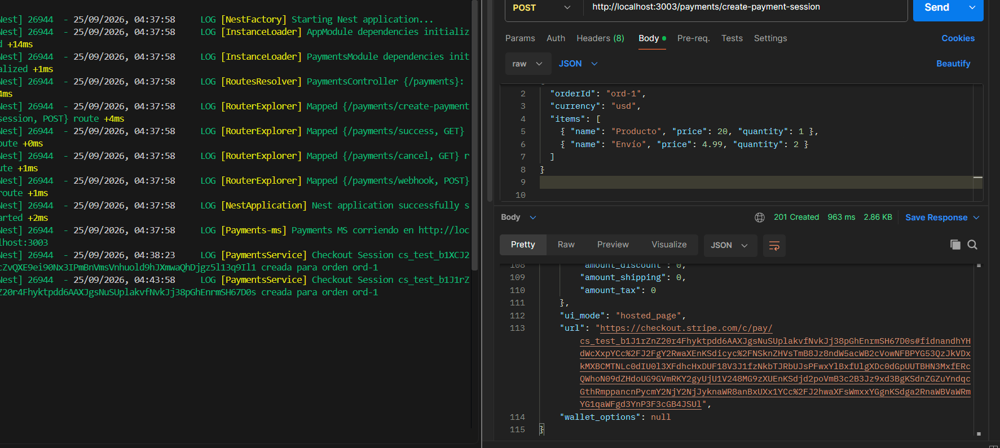
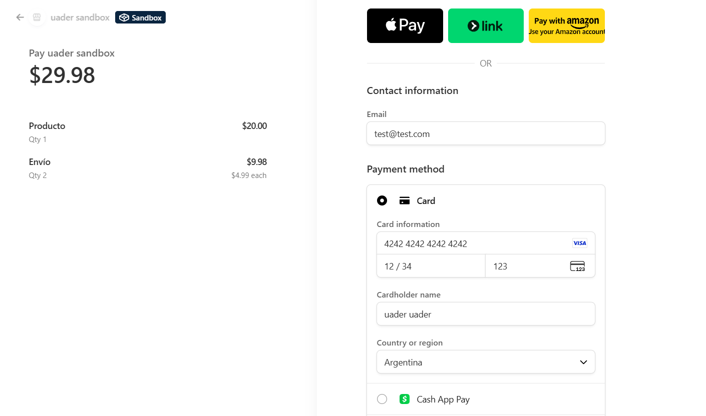
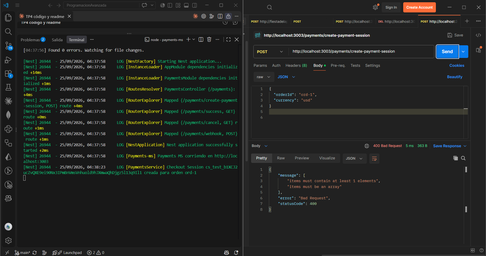
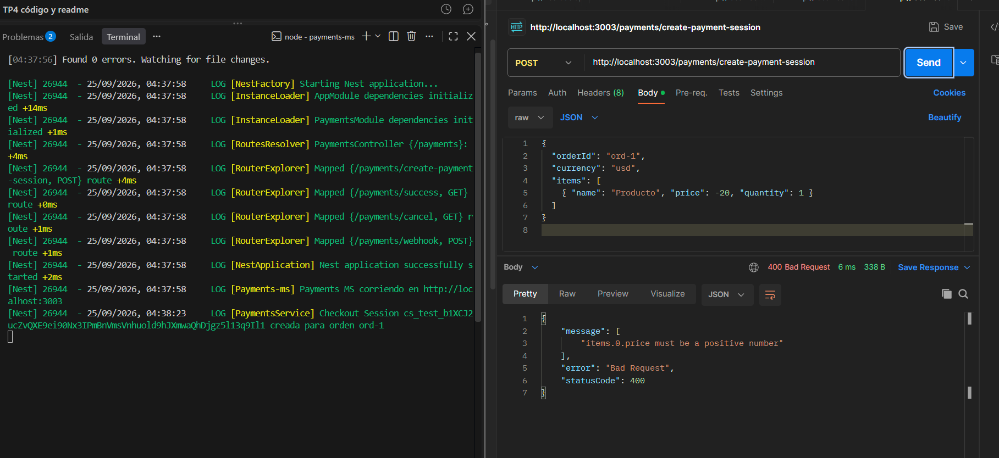
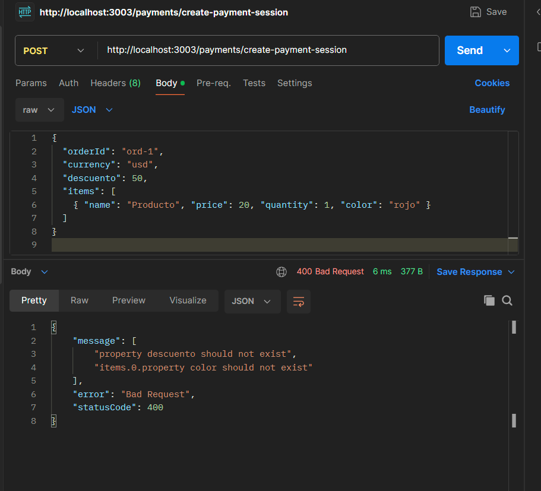
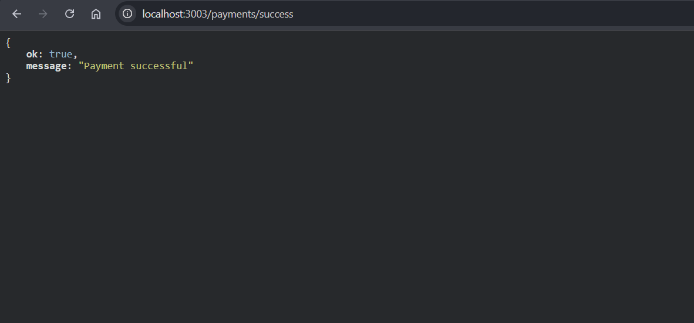
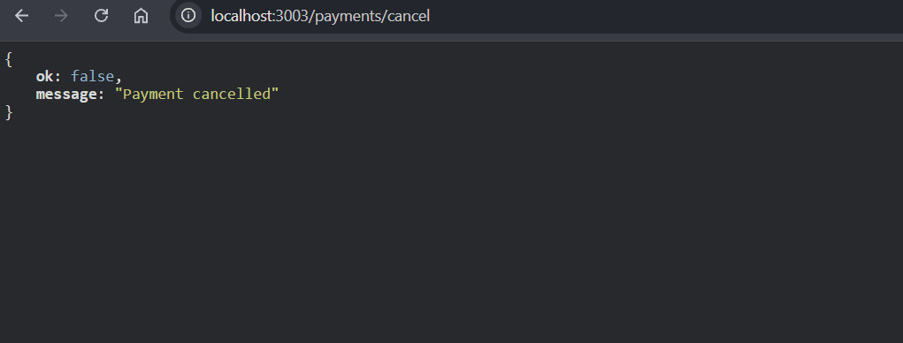
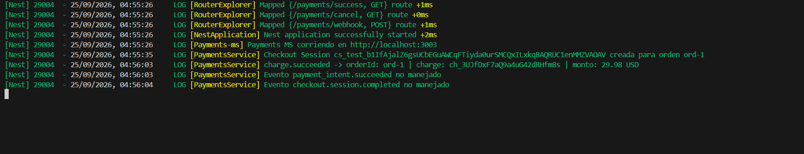
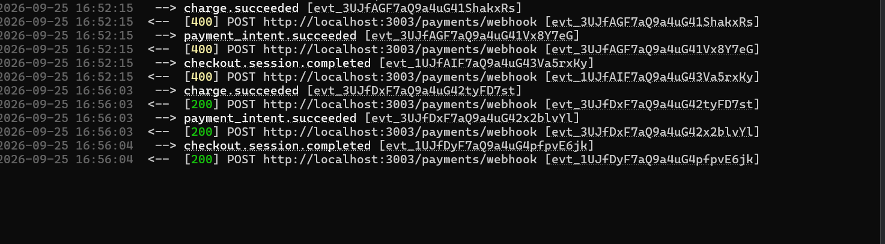
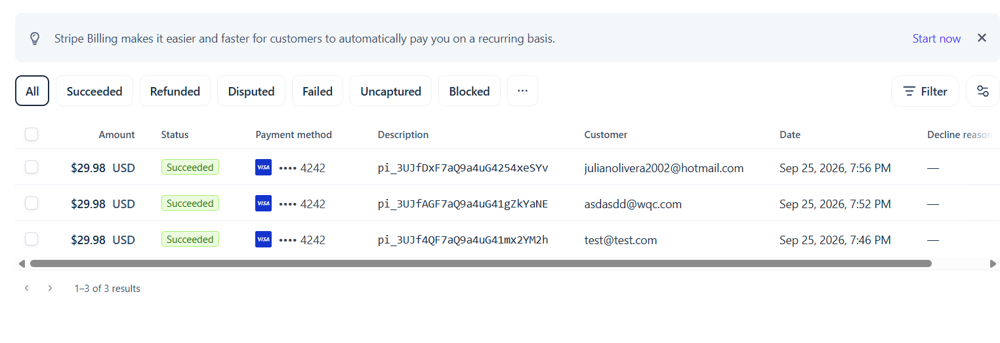

# TP4 - Sesiones de pago y webhook Stripe

Microservicio HTTP en NestJS que:

1. **Crea sesiones de pago** (Stripe Checkout, `mode: payment`) a partir de un
   pedido que envía el cliente.
2. **Recibe el webhook de Stripe** cuando el cobro se concreta
   (`charge.succeeded`), verifica la firma y registra el `orderId`.

Fuera de alcance (según la consigna): integración con el MS de órdenes,
NATS/TCP, reembolsos y modo live.

## Stack

- Node.js 20 + NestJS 11 (TypeScript)
- SDK oficial `stripe`
- `class-validator` / `class-transformer` para el DTO
- `joi` + `dotenv` para la configuración fail-fast

## Estructura

```
payments-ms/
├── src/
│   ├── config/
│   │   ├── envs.ts                     # Valida el .env con joi (fail-fast)
│   │   └── index.ts
│   ├── payments/
│   │   ├── dto/payment-session.dto.ts  # PaymentSessionDto + PaymentSessionItemDto
│   │   ├── payments.controller.ts      # Rutas /payments/*
│   │   ├── payments.service.ts         # Checkout Session + verificación del webhook
│   │   └── payments.module.ts
│   ├── app.module.ts
│   └── main.ts                         # rawBody: true + ValidationPipe global
├── screenshots/                        # Capturas de las pruebas
├── .env.template                       # Copiar a .env
├── requests.http                       # Pedidos de prueba
└── package.json
```

## Cómo levantar

Requisitos: Node.js 20+, una cuenta de Stripe en **modo test** y
[Stripe CLI](https://docs.stripe.com/stripe-cli) (en Windows:
`winget install Stripe.StripeCli`).

```bash
npm install
cp .env.template .env        # completar STRIPE_SECRET con la sk_test_...
```

En otra terminal, loguearse en Stripe CLI y reenviar los eventos al MS:

```bash
stripe login
stripe listen --events charge.succeeded,payment_intent.succeeded,checkout.session.completed --forward-to localhost:3003/payments/webhook
```

Las versiones recientes de Stripe CLI obligan a indicar qué eventos reenviar
(`--events`, o `--all-snapshot` para todos). Además de `charge.succeeded` se
reenvían dos eventos más para ver el caso "no manejado".

`stripe listen` imprime un `whsec_...`: ese valor va en
`STRIPE_ENDPOINT_SECRET` del `.env`. Después se levanta el MS:

```bash
npm run start:dev
```

Queda escuchando en `http://localhost:3003`. Si falta alguna variable del
`.env`, el proceso no arranca y muestra cuál falta.

### Variables de entorno

| Variable | Uso |
|---|---|
| `PORT` | Puerto HTTP (sugerido `3003`) |
| `STRIPE_SECRET` | Clave secreta de test (`sk_test_...`) |
| `STRIPE_SUCCESS_URL` | Redirect tras pagar, p. ej. `http://localhost:3003/payments/success` |
| `STRIPE_CANCEL_URL` | Redirect si se cancela, p. ej. `http://localhost:3003/payments/cancel` |
| `STRIPE_ENDPOINT_SECRET` | Signing secret del webhook (`whsec_...`) |

El `.env` no se versiona; sí el `.env.template`.

## Rutas

| Método | Ruta | Descripción |
|---|---|---|
| `POST` | `/payments/create-payment-session` | Crea la Checkout Session y devuelve la sesión de Stripe (`id`, `url`, ...) |
| `POST` | `/payments/webhook` | Recibe eventos de Stripe (header `stripe-signature` + cuerpo crudo) |
| `GET` | `/payments/success` | `{ "ok": true, "message": "Payment successful" }` |
| `GET` | `/payments/cancel` | `{ "ok": false, "message": "Payment cancelled" }` |

### 1. `POST /payments/create-payment-session`

```bash
curl -X POST http://localhost:3003/payments/create-payment-session \
  -H "Content-Type: application/json" \
  -d '{"orderId":"ord-1","currency":"usd","items":[{"name":"Producto","price":20,"quantity":1}]}'
```

| Campo | Regla |
|---|---|
| `orderId` | string obligatorio; viaja en `payment_intent_data.metadata` |
| `currency` | string obligatorio (p. ej. `usd`) |
| `items` | array con al menos un ítem |
| `items[].name` | string no vacío |
| `items[].price` | número positivo; se envía a Stripe en centavos (`Math.round(price * 100)`) |
| `items[].quantity` | número positivo |

Cualquier request inválido (sin `items`, precio negativo, campos que no están en
el DTO, etc.) responde **400** gracias al `ValidationPipe` global con
`whitelist` y `forbidNonWhitelisted`.

La respuesta es la sesión que devuelve Stripe; el campo `url` es la página de
Checkout a la que hay que redirigir al usuario. Para pagar en modo test se usa
la tarjeta `4242 4242 4242 4242`, cualquier fecha futura y cualquier CVC
([más tarjetas de prueba](https://docs.stripe.com/testing)).

### 2. `POST /payments/webhook`

| Caso | Respuesta |
|---|---|
| Sin header `stripe-signature` o firma inválida | `400 Webhook Error: ...`, el evento no se procesa |
| `charge.succeeded` | Log con el `orderId` (y id/monto del cargo), `200` |
| Cualquier otro `event.type` | Log `Evento <tipo> no manejado`, `200` para que Stripe no reintente |

Ejemplo del log al completar un pago:

```
LOG [PaymentsService] charge.succeeded -> orderId: ord-1 | charge: ch_... | monto: 20 USD
```

## Detalles de implementación

**Cuerpo crudo para la firma**: Stripe firma los bytes exactos que envía. Si
Nest parsea el JSON y lo vuelve a serializar, la firma deja de coincidir. Por
eso la app se crea con `NestFactory.create(AppModule, { rawBody: true })` y el
webhook usa `req.rawBody` en `stripe.webhooks.constructEvent(rawBody, signature,
STRIPE_ENDPOINT_SECRET)`.

**`orderId` en la metadata del PaymentIntent**: la metadata de la Checkout
Session no se copia al cargo, pero la de `payment_intent_data.metadata` sí. Así
el evento `charge.succeeded` trae `metadata.orderId` y el webhook puede saber
qué orden se pagó.

**Por qué el webhook y no `/success`**: el usuario puede cerrar la pestaña antes
de volver a `/success`. La confirmación confiable del cobro es el aviso que
Stripe manda al webhook; `/success` y `/cancel` son solo páginas de retorno.

**Config fail-fast**: `src/config/envs.ts` valida el `.env` con `joi` al
importar el módulo; si falta alguna variable, la app corta el arranque en vez de
fallar recién en el primer request.

## Pruebas

`requests.http` tiene los pedidos listos (extensión REST Client de VS Code, o
copiarlos a Postman). Flujo completo:

1. `stripe listen` corriendo y el MS levantado.
2. Crear la sesión con el request 1 y abrir la `url` de la respuesta.
3. Pagar con la tarjeta `4242 4242 4242 4242` → Stripe redirige a `/payments/success`.
4. En la consola del MS aparece el log de `charge.succeeded` con `orderId: ord-1`,
   y en la de `stripe listen` el `[200] POST .../payments/webhook`.
5. Requests 2 a 5: todos responden `400`.

> `stripe trigger charge.succeeded` sirve para probar el webhook, pero ese evento
> sintético no trae `orderId` (se loguea `undefined`). Para ver el `orderId` hay
> que hacer el pago real de prueba desde la `url` de Checkout.

## Evidencia

### Entrega 1: sesión de pago

**Request válido**: `201 Created` con el `id` de la sesión y la `url` de Checkout.



**Checkout de Stripe** abierto desde esa `url` (20 × 1 + 4.99 × 2 = 29.98 USD):



**Requests inválidos**: todos responden `400`.

| Sin `items` | Precio negativo | Campos extra |
|---|---|---|
|  |  |  |

**Redirects** de Checkout (`/success` tras pagar, `/cancel` al volver sin pagar):

| Success | Cancel |
|---|---|
|  |  |

### Entrega 2: webhook

**Log del MS**: llega `charge.succeeded` con el `orderId: ord-1` de la entrega 1;
los otros eventos se registran como no manejados.



**`stripe listen`**: los primeros eventos dan `[400]` porque el MS todavía tenía
un signing secret que no coincidía (la firma no se pudo verificar y el evento no
se procesó). Con el `whsec_` correcto, Stripe recibe `[200]`.



**Dashboard de Stripe**: los pagos de prueba en estado *Succeeded*.


